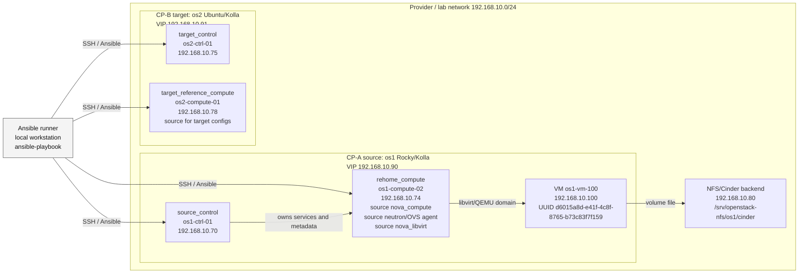
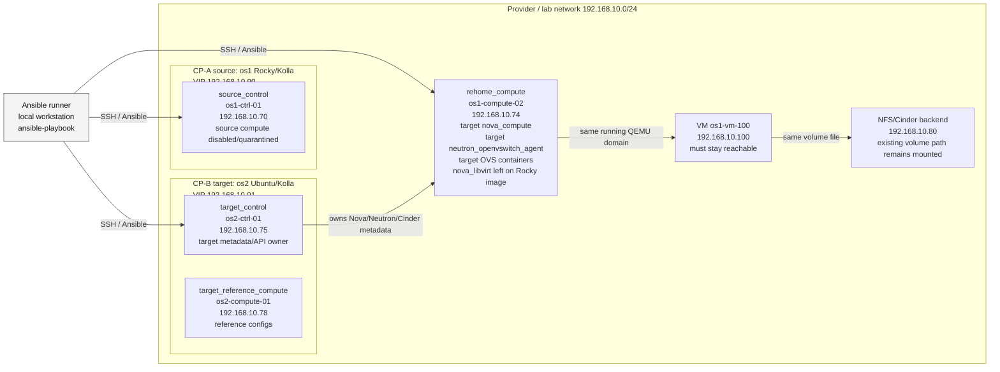

# Lab topology: re-home os1-compute-02 из os1 в os2

Документ фиксирует лабораторный стенд, на котором проверялся re-home compute
host с уже запущенной ВМ. Цель схемы - быстро показать, где запускается
Ansible, какие hosts указаны в inventory, какой host переносится, где остается
ВМ и какая сеть используется для проверки непрерывности.

## Узлы и роли

| Inventory group | Host | IP | Роль |
| --- | --- | --- | --- |
| Ansible runner | локальная машина оператора | не фиксируется | Запускает `ansible-playbook` из этого репозитория |
| `source_control` | `os1-ctrl-01` | `192.168.10.70` | Control plane CP-A/source, VIP `192.168.10.90` |
| `target_control` | `os2-ctrl-01` | `192.168.10.75` | Control plane CP-B/target, VIP `192.168.10.91` |
| `target_reference_compute` | `os2-compute-01` | `192.168.10.78` | Эталонный compute CP-B, источник target Kolla configs |
| `rehome_compute` | `os1-compute-02` | `192.168.10.74` | Compute host, который переносится между control planes |
| VM | `os1-vm-100` | `192.168.10.100` | ВМ, которая должна оставаться running и доступной по сети |
| NFS/Cinder | NFS server | `192.168.10.80` | Backend Cinder volume для ВМ |

## Состояние до re-home

До cutover host `os1-compute-02` полностью принадлежит source control plane:
source Nova знает compute service, source Neutron обслуживает port binding, а
source Kolla containers задают runtime. Target control plane существует рядом,
но еще не управляет этим host.

## Состояние после re-home

После cutover control-plane agents на `os1-compute-02` работают с target
конфигурацией и target image tags:

- `nova_compute`;
- `neutron_openvswitch_agent`;
- `openvswitch_db` и `openvswitch_vswitchd`;
- support containers `fluentd`, `cron`, `kolla_toolbox`, `nova_ssh`.

`nova_libvirt` в lab оставлен на Rocky image, потому что target Ubuntu image и
Rocky 10 candidate не поддержали machine type уже запущенной ВМ
`pc-i440fx-rhel7.6.0`. Это допустимое промежуточное состояние: ВМ продолжает
работать, а смена `nova_libvirt` вынесена в отдельный guarded шаг после
прохождения machine type preflight.

## Проверочная сеть ВМ

В обоих кластерах создана одинаковая provider/self-service сеть без DHCP для
проверки непрерывности адреса ВМ:

- адрес ВМ: `192.168.10.100`;
- проверочный диапазон: `192.168.10.100-192.168.10.110`;
- runtime guard проверяет reachability с `os2-ctrl-01`.

Важное ограничение: одинаковая адресация в target cluster не заменяет перенос
Neutron metadata. Для OVS нужно сохранить/нормализовать port UUID, binding
levels, MAC и fixed IP, иначе target Neutron может видеть port через API, но
dataplane агент получит "port is not bound".

## Что менять при переносе в другую инфраструктуру

В `inventory/lab-os1-to-os2.yml` заменить:

- IP и DNS names всех hosts;
- `source_vip`, `target_vip`;
- `rehome_host` и `hypervisor_hostname`;
- пути к локальным `clouds.yaml`, `passwords.yml`, artifacts;
- target image tags и base distro;
- `runtime_guard_probe_targets`;
- source-only services, которых нет в target cluster;
- Cinder/NFS metadata normalizations, если storage backend отличается.

Перед адаптацией inventory обязательно пройти `operator-inputs-ru.md`: там
перечислены входные секреты, clouds/configs, DB prerequisites и guardrails.
