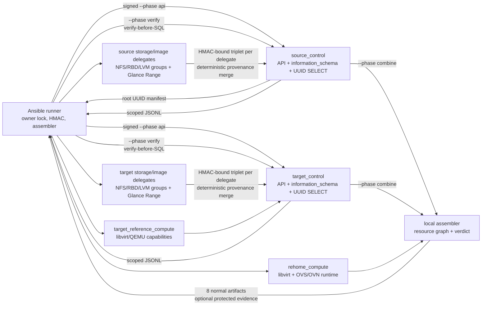

# Поток данных live discovery

Live discovery — отдельный read-only gate перед любым DB import или cutover.
Source profile фиксирован как `keystack-2025.1`, canonical target — живой
`vanilla-openstack-2025.1-epoxy`. Загруженная schema/DB dump не является
источником истины; dump допустим только как санитизированная fixture тестов.

## Схема

## Семь plays и зависимый порядок

Playbook содержит ровно семь plays; этот порядок определяется данными и не
может быть распараллелен произвольно:

1. `localhost` фиксирует singleton roles, переменные, `run-id`, случайный owner
   token и защищённые inputs; затем атомарно захватывает owner lock.
2. `source_control` доказывает профиль `keystack-2025.1` по live labels/digests
   образов Nova, Neutron, Cinder и Glance, через host-scoped join читает
   `nova_api.host_mappings`/`cell_mappings`, безопасно выделяет фактическую
   cell schema без credentials, затем выполняет первую `--phase api`, live
   `information_schema`, `--phase verify` и — только с проверенным plan digest
   — UUID-scoped SELECT/JSONL по выбранной cell.
3. `target_control` повторяет API/schema/verify/SQL на canonical target и
   собирает live DB revisions/container evidence.
4. `rehome_compute` собирает libvirt domains/disks/interfaces и OVS/OVN runtime.
5. `target_reference_compute` собирает target virsh/QEMU capabilities.
6. `localhost` группирует Cinder backing probes по явно заданным source/target
   delegate, выполняет отдельную защищённую API phase на каждом из них,
   проверяет HMAC и общий API/query scope, детерминированно объединяет evidence
   с provenance, возвращает итоговый подписанный triplet контроллерам и
   вызывает `--phase combine` для каждой стороны.
7. `localhost` запускает assembler, принимает только exit `0`, публикует
   artifacts и завершает owner marker с удалением frozen secrets.

Таким образом, это подписанный двухфазный API/DB acquisition: API определяет
живые roots и scope, DB phase выполняется только после `--phase verify`.
`verified-plan.json` привязан к canonical plan SHA-256 непосредственно перед
SQL. SQL разрешён только как SELECT; API/SQL mutations отсутствуют.

Схемный artifact включает не только колонки, но и `STATISTICS`, unique indexes,
`KEY_COLUMN_USAGE`/`REFERENTIAL_CONSTRAINTS`, направления foreign keys и
действия update/delete. Имена схем проходят строгую проверку, SQL literals
строит отдельный Python helper. Policy только разрешает профиль source:
отсутствующее или несовпадающее live evidence оставляет mapping в
`UNKNOWN`/`BLOCKED`, а не присваивает Keystack по имени файла.

На пустом pre-import target отсутствие source-derived UUID, compute service,
hypervisor или placement provider с ответом 404 становится типизированным
evidence/check и не мешает assembler выпустить отчёт. Ответ 403, отсутствие
endpoint и некорректный JSON по-прежнему отклоняются fail-closed.

Каждый configured source/target storage delegate выполняет обе семьи:
назначенную ему группу Cinder backing probes и Glance Range probes. Поэтому
каждый delegate должен иметь сетевой доступ к соответствующему Glance
endpoint/token и локальный read-only доступ к заявленным NFS/file, RBD или LVM
resources. Несколько delegate на одной стороне поддерживаются одновременно;
неидентичный Glance/API scope или неверный binding блокирует merge.

## Доверие и границы

- Root manifest выводится из первой source API phase, а не подаётся оператором
  и не строится из dump.
- Phase artifacts привязаны HMAC к side, API facts, UUID filters, query plan и
  probe results. Fixture и live signatures разделены.
- Source и target Glance tokens раздельны и обязаны иметь разные checksums.
- Caller files mode `0600` открываются один раз без symlink-follow, копируются
  в owned каталог `0700`, после чего исходные пути повторно не читаются.
- Raw DB stderr, failed command stdout, container inspect и Cinder secrets не
  становятся normal artifacts; сохраняются только safe class/hash/typed facts.
- `online_data_migrations` не запускаются. Допустим только свежий защищённый
  operator evidence о ранее выполненных Nova/Cinder проверках с точными live
  revisions; отсутствие или несовпадение даёт `UNKNOWN`/`BLOCKED`.
- Masakari/DRS исключены.

## Сбой, cleanup и повторный запуск

Каждый последующий play проверяет `run-id` и owner token. Rescue/unreachable
cleanup удаляет только собственный незавершённый lock и защищённые временные
данные; чужой или completed owner не затрагивается. Для повторного запуска
использовать новый автоматически сгенерированный `run-id` либо явно новый ID.
Не переиспользовать ID concurrent запуска и не удалять `.control/owners`
вручную без проверки completion marker.

Fixture/syntax tests подтверждают контракт и Ansible структуру, но не являются
результатом реального live deployment. Exact operator inputs описаны в
[`operator-inputs-ru.md`](../operator-inputs-ru.md), финальные файлы — в
[`live-discovery-artifacts-ru.md`](live-discovery-artifacts-ru.md).
